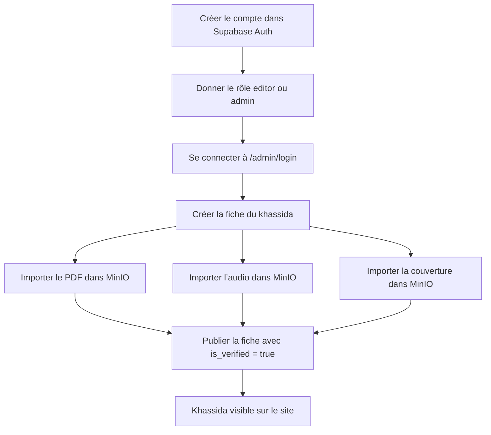
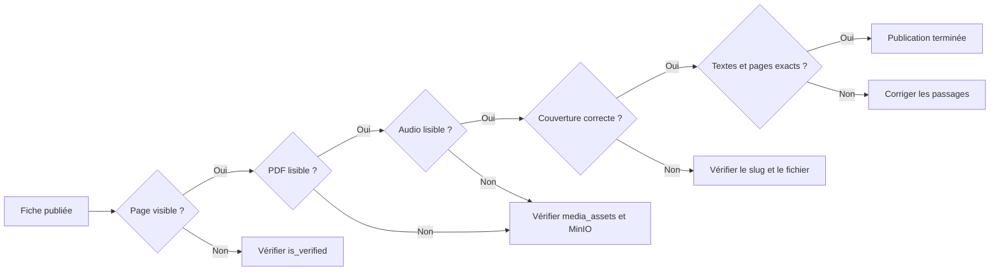

# Ajouter un nouveau khassida

Ce document décrit le workflow éditorial actuel de Xassida Search pour ajouter une fiche, ses éditions PDF, un audio et une couverture.

## Vue d’ensemble



## Où va chaque élément ?

| Élément | Où l’ajouter ? | Destination |
| --- | --- | --- |
| Fiche du khassida | `/admin` | Table Supabase `khassidas` |
| PDF | `/admin`, panneau « Importer dans MinIO » | MinIO + table `media_assets` |
| Audio | `/admin`, panneau « Importer dans MinIO » | MinIO + table `media_assets` |
| Couverture | `/admin`, panneau « Importer un média » | MinIO + table `media_assets` |
| Publication | Supabase SQL Editor | Colonne `khassidas.is_verified` |

## 1. Préparer les fichiers

Préparer de préférence :

- un PDF lisible de moins de 60 Mo ;
- un fichier audio MP3, M4A ou OGG de moins de 150 Mo ;
- une couverture PNG ou WebP nette ;
- le titre officiel et le titre arabe ;
- les variantes du titre et les thèmes ;
- les différentes éditions et traductions disponibles ;
- le nom et la provenance de la source.

Utiliser des noms de fichiers simples, sans caractères spéciaux :

```text
nom-du-khassida.pdf
nom-du-khassida.mp3
nom-du-khassida.png
```

## 2. Accéder à l’administration

Démarrer l’application :

```bash
bun run dev
```

Ouvrir ensuite :

```text
http://localhost:3000/admin/login
```

Le compte doit exister dans **Supabase Authentication** et posséder un rôle d’équipe dans la table `profiles`. Le mot de passe n’est pas enregistré dans le dépôt.

## 3. Créer la fiche

Dans `/admin`, remplir le formulaire « Ajouter un khassida » :

1. titre officiel ;
2. titre arabe ;
3. variantes séparées par des virgules ;
4. thèmes séparés par des virgules ;
5. description.

L’application crée automatiquement un slug. Exemple :

```text
astahfirul-laha-bihi-a1b2c3
```

Noter ce slug : il sert pour l’URL publique et le nom de la couverture.

## 4. Importer le PDF

Dans le panneau « Importer dans MinIO » :

1. sélectionner le khassida ;
2. choisir `PDF` ;
3. sélectionner le fichier ;
4. cliquer sur « Stocker dans MinIO ».

Le stockage est automatique :

```text
MinIO
└── khassidas
    └── {id-du-khassida}
        └── pdf
            └── {identifiant}-{nom-du-fichier}.pdf
```

Le fichier est privé. L’application le sert par `/api/media/{id}` avec une URL signée temporaire. Importer un nouveau PDF le rend principal à la place du précédent.

## 5. Importer l’audio

Dans le même panneau :

1. sélectionner le khassida ;
2. choisir `Audio` ;
3. sélectionner le fichier ;
4. cliquer sur « Stocker dans MinIO ».

Le stockage est automatique :

```text
MinIO
└── khassidas
    └── {id-du-khassida}
        └── audio
            └── {identifiant}-{nom-du-fichier}.mp3
```

Importer un nouvel audio le rend principal à la place du précédent.

## 6. Ajouter la couverture et les métadonnées

Dans « Importer un média », choisir `Couverture`, puis sélectionner une image PNG, JPG ou WebP de moins de 10 Mo. La couverture est stockée dans MinIO et apparaît automatiquement sur les cartes et la fiche.

Dans « Modifier une fiche », renseigner ou corriger les thèmes abordés, la description, le nombre de pages et le nombre de vers. Ces nombres alimentent les badges du catalogue même si les passages n’ont pas encore été saisis un à un.

## 7. Ajouter une traduction

Une traduction ne doit pas devenir un nouveau khassaïde et ne doit pas remplacer le PDF arabe. Le modèle cible est une liste d’éditions rattachées à la même œuvre : original arabe, traduction française, anglaise ou wolof. Chaque édition conserve sa langue, son type, son traducteur, sa source, son année, son nombre de pages et son fichier MinIO.

Dans `/admin`, utiliser « Ajouter une édition ou une traduction » : sélectionner le khassaïde, le type, la langue, le traducteur, l’éditeur, l’année, le nombre de pages et la source, puis importer le PDF. Un éditeur l’enregistre « À valider »; un validateur ou administrateur peut la publier directement. Les éditions validées apparaissent dans le sélecteur du lecteur sans remplacer le PDF arabe principal.

## 8. Publier la fiche

Après vérification du PDF, de l’audio et de la source, publier la fiche depuis l’administration avec un compte validateur ou administrateur.

```sql
update public.khassidas
set is_verified = true
where slug = 'slug-du-khassida';
```

Pour retirer temporairement une fiche :

```sql
update public.khassidas
set is_verified = false
where slug = 'slug-du-khassida';
```

## 9. Vérifier avant la mise en ligne



Contrôles techniques :

```bash
bun run typecheck
bun run build
```

Contrôles fonctionnels :

- la fiche apparaît sur l’accueil ou dans la bibliothèque ;
- la page `/khassidas/{slug}` s’ouvre ;
- le PDF se charge ;
- l’audio démarre, se met en pause et peut être parcouru ;
- la couverture correspond au bon khassida ;
- les références de pages et de vers sont exactes ;
- aucun brouillon n’est visible publiquement.

## Checklist rapide

- [ ] Compte administrateur ou éditeur disponible
- [ ] Fiche créée
- [ ] Slug noté
- [ ] Source renseignée et contrôlée
- [ ] PDF importé
- [ ] Audio importé
- [ ] Couverture ajoutée
- [ ] Passages saisis
- [ ] Passages validés
- [ ] Fiche publiée
- [ ] Page publique contrôlée sur mobile et ordinateur
