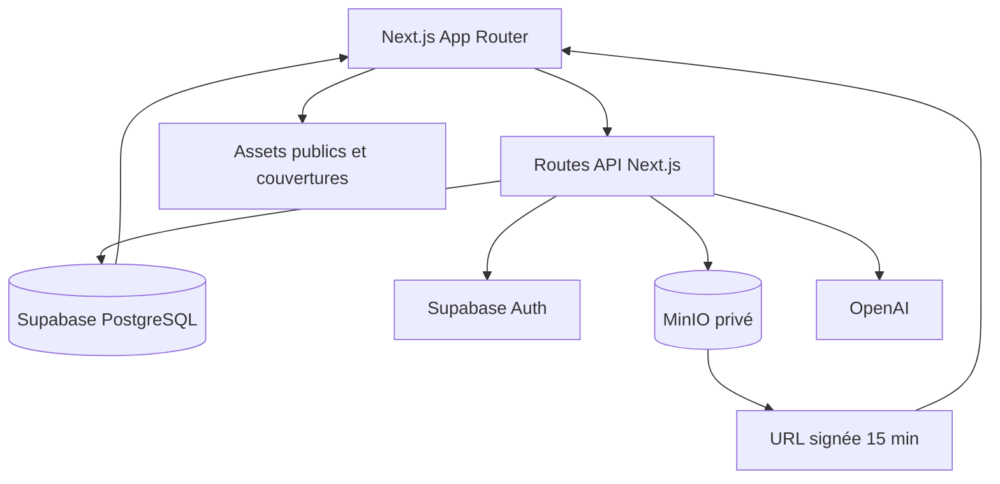
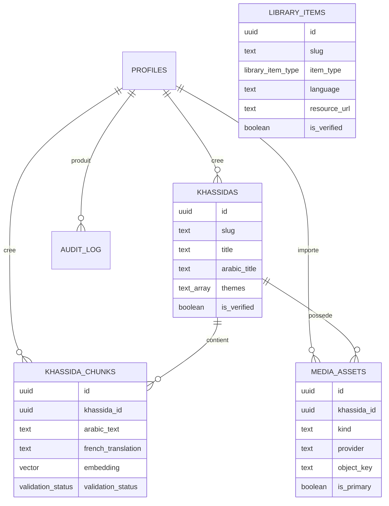

# Architecture du projet

## Vue générale

Xassida Search est une application **Next.js 15 / React 19 / TypeScript**. Les pages publiques sont rendues avec l’App Router. Supabase fournit PostgreSQL, l’authentification et les règles d’accès. MinIO conserve les PDF et audios privés. OpenAI est utilisé pour les embeddings et les réponses RAG sourcées.

## Arborescence

| Emplacement | Responsabilité |
| --- | --- |
| `app/` | Pages, layouts et routes API Next.js |
| `components/` | Interfaces réutilisables et composants clients |
| `lib/` | Accès Supabase, MinIO, normalisation et utilitaires |
| `types/` | Types TypeScript métier |
| `scripts/` | Imports, migration de médias et alimentation documentaire |
| `supabase/migrations/` | Schéma PostgreSQL versionné et politiques RLS |
| `public/images/` | Couvertures et éléments visuels publics |
| `docs/` | Documentation technique et éditoriale |

## Routes publiques

| Route | Rôle | Source principale |
| --- | --- | --- |
| `/` | Accueil, découverte et recherche rapide | `/api/search` |
| `/khassidas` | Catalogue des œuvres poétiques | `khassidas`, `khassida_chunks`, `media_assets` |
| `/khassidas/[slug]` | Informations, lecture et audio d’une œuvre | mêmes tables |
| `/bibliotheque` | Ressources documentaires mourides | `library_items` |
| `/bibliotheque/[slug]` | Fiche interne d’une ressource | `library_items` |
| `/themes` | Exploration thématique des khassaïdes | catalogue |
| `/collections` | Parcours éditoriaux statiques | code de la page |
| `/recherche-ia` | Questions sourcées sur le corpus validé | `/api/ask` |
| `/a-propos` | Mission et principes du projet | contenu statique |
| `/admin/login` | Authentification de l’équipe | Supabase Auth |
| `/admin` | Création de fiches, passages et médias | routes `/api/admin/*` |

## Routes API

| Méthode et route | Fonction | Protection |
| --- | --- | --- |
| `GET /api/search?q=` | Recherche titres et passages validés | publique, RLS |
| `POST /api/ask` | Embedding, recherche hybride et réponse sourcée | publique, clés serveur |
| `GET /api/media/[id]` | Redirection vers un média externe ou une URL MinIO signée | publique pour œuvre publiée, RLS |
| `GET/POST /api/admin/khassidas` | Lister et créer les œuvres | bearer token + rôle équipe |
| `POST /api/admin/chunks` | Ajouter un passage et son embedding | rôle équipe; validation réservée |
| `POST /api/admin/upload` | Importer PDF/audio dans MinIO | bearer token + rôle équipe |

## Modèle de données

`library_items` est volontairement indépendant des khassaïdes. Une ressource documentaire peut parler du mouridisme sans être elle-même une œuvre poétique.

## Accès et sécurité

- Le public lit uniquement les œuvres, passages et ressources `verified`.
- Les rôles `editor`, `validator` et `admin` sont portés par `profiles`.
- Seuls `validator` et `admin` peuvent créer directement un passage `verified`.
- La clé Supabase de service, les clés MinIO et la clé OpenAI restent côté serveur.
- MinIO est privé; `/api/media/[id]` génère une URL temporaire de 15 minutes.
- `audit_log` conserve les créations de fiches et de passages; sa lecture est réservée aux administrateurs.

## Rendu et état client

Les pages catalogue et détail chargent leurs données côté serveur. Les composants marqués `"use client"` gèrent les filtres, le lecteur audio, les formulaires, le menu mobile et l’assistant conversationnel. Les couvertures spéciales sont actuellement résolues dans le code à partir du slug et stockées dans `public/images/covers/`.

