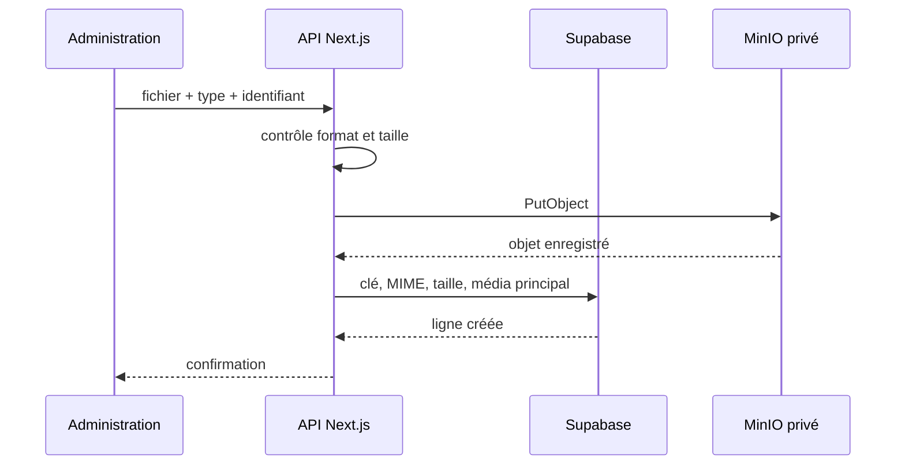
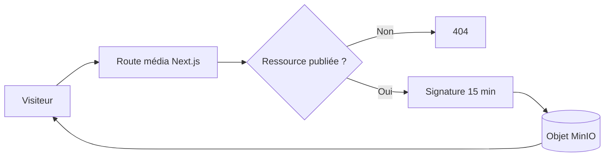

# Stockage MinIO

MinIO est l’unique stockage des fichiers privés de Xassida Search. Supabase conserve les métadonnées et les clés d’objet; les fichiers binaires ne sont ni enregistrés dans PostgreSQL, ni conservés dans `public/`, ni commités dans Git.

## Architecture



Le bucket par défaut est `xassida-media`. Il reste privé. Le navigateur ne reçoit jamais les identifiants MinIO.

## Variables d’environnement

```env
MINIO_ENDPOINT=http://127.0.0.1:9000
MINIO_REGION=us-east-1
MINIO_ACCESS_KEY=minioadmin
MINIO_SECRET_KEY=change-me
MINIO_BUCKET=xassida-media
MINIO_FORCE_PATH_STYLE=true
```

| Variable | Description |
| --- | --- |
| `MINIO_ENDPOINT` | URL S3 de MinIO, accessible depuis le serveur Next.js |
| `MINIO_REGION` | Région S3 utilisée pour signer les requêtes |
| `MINIO_ACCESS_KEY` | Identifiant d’un compte de service MinIO |
| `MINIO_SECRET_KEY` | Secret du compte de service |
| `MINIO_BUCKET` | Bucket privé; valeur par défaut `xassida-media` |
| `MINIO_FORCE_PATH_STYLE` | `true` pour le format `endpoint/bucket/object`, généralement requis avec MinIO |

Toutes ces variables sont réservées au serveur. Ne jamais leur ajouter le préfixe `NEXT_PUBLIC_` et ne jamais commiter `.env.local`.

## Arborescence des objets

```text
xassida-media/
├── khassidas/
│   └── {khassida_id}/
│       ├── pdf/
│       │   └── {uuid}-{nom-nettoye}.pdf
│       ├── audio/
│       │   └── {uuid}-{nom-nettoye}.mp3
│       └── cover/
│           └── {uuid}-{nom-nettoye}.png
└── library/
    └── {slug}/
        └── {slug}.pdf
```

Les UUID évitent les collisions lors d’un nouvel import. Le nom d’origine est nettoyé par `safeObjectName` : suppression des accents et remplacement des caractères dangereux.

## Métadonnées Supabase

### Médias des khassaïdes

La table `media_assets` relie chaque fichier à `khassidas` :

| Colonne | Utilité |
| --- | --- |
| `khassida_id` | œuvre propriétaire |
| `kind` | `pdf`, `audio` ou `cover` |
| `provider` | `minio` ou ancien média `external` |
| `bucket` | nom du bucket |
| `object_key` | chemin exact de l’objet |
| `mime_type` | type HTTP du fichier |
| `file_name` | nom original |
| `file_size` | taille en octets |
| `is_primary` | fichier actuellement utilisé pour ce type |

Un index garantit au maximum un média principal par type et par khassaïde. Remplacer un média marque d’abord l’ancien comme non principal, puis crée une nouvelle ligne principale. L’ancien objet n’est pas supprimé automatiquement : cela permet un retour arrière, mais nécessite une politique de rétention.

### Documents de la bibliothèque

`library_items` contient directement :

- `media_bucket`;
- `media_object_key`;
- `media_mime_type`;
- `media_file_name`;
- `media_file_size`.

Ces champs ont été ajoutés par `005_library_media.sql`.

## Import depuis l’administration

Dans `/admin`, sélectionner le khassaïde puis :

- importer le PDF ou l’audio dans « Importer un média »;
- sélectionner la fiche dans « Modifier une fiche » pour importer ou remplacer sa couverture.

Limites appliquées côté serveur :

| Type | Formats | Limite |
| --- | --- | --- |
| PDF | `application/pdf` | 60 Mo |
| Audio | tout MIME `audio/*` | 150 Mo |
| Couverture | PNG, JPEG, WebP | 10 Mo |

La route `POST /api/admin/upload` revalide la session, le rôle, l’identifiant du khassaïde, le type MIME et la taille. Le simple contrôle HTML du navigateur n’est jamais considéré comme suffisant.

## Accès public sécurisé

### Khassaïdes

L’application expose `/api/media/[id]` :

1. Supabase vérifie que la ligne est lisible avec les politiques RLS;
2. le serveur génère une URL MinIO signée pendant 900 secondes;
3. PDF et audio sont redirigés vers cette URL temporaire;
4. les couvertures sont relayées par la route serveur pour rester compatibles avec l’affichage Next.js.

### Bibliothèque

`/api/library-media/[id]` vérifie que la ressource est publiée, puis redirige vers une URL signée de 900 secondes. Le lecteur PDF interne utilise cette route.



Une URL signée n’est pas une URL permanente. Elle doit être régénérée après expiration.

## Scripts disponibles

| Commande | Usage |
| --- | --- |
| `bun run migrate:minio` | migrer les anciens médias référencés |
| `bun run import:astahfir` | importer les médias d’Astahfirul Laha Bihi |
| `bun run import:jazbul-audio` | importer l’audio de Jazbul Qulub |
| `bun run import:library-documents -- /dossier` | importer les PDF documentaires préparés |
| `bun run migrate:legacy-covers` | migration historique des deux couvertures locales |

Les scripts utilisent `.env.local` et la clé Supabase de service. Ils modifient le stockage distant et la base; les lancer uniquement depuis un environnement maîtrisé.

## Vérifications après import

Dans Supabase :

```sql
select id, khassida_id, kind, object_key, mime_type, file_size, is_primary
from public.media_assets
order by created_at desc;
```

Contrôler ensuite :

- que `object_key` existe réellement dans le bucket;
- que `file_size` correspond à la taille de l’objet;
- que le type MIME est correct;
- qu’un seul fichier est principal par type;
- que `/api/media/{id}` ou `/api/library-media/{id}` répond;
- que les PDF acceptent les requêtes HTTP Range, utiles au lecteur intégré;
- que le fichier est visible uniquement lorsque sa fiche est publiée.

## Diagnostic

### « MinIO n’est pas configuré »

Une des variables `MINIO_ENDPOINT`, `MINIO_ACCESS_KEY` ou `MINIO_SECRET_KEY` est absente du processus serveur. Redémarrer Next.js après modification de `.env.local`.

### Erreur de connexion

- vérifier que `MINIO_ENDPOINT` est accessible depuis le serveur, pas seulement depuis le navigateur;
- vérifier le port de l’API S3 — il peut être différent du port de la console MinIO;
- confirmer TLS et le protocole `http`/`https`;
- vérifier `MINIO_FORCE_PATH_STYLE=true`.

### Média 404

- vérifier la ligne Supabase;
- vérifier que la fiche est publiée;
- vérifier `is_primary`;
- vérifier que `object_key` n’est ni vide ni erroné;
- confirmer la présence de l’objet dans le bucket.

### PDF ou audio non pris en charge

- contrôler `mime_type`;
- télécharger quelques octets et vérifier la signature réelle du fichier;
- pour un PDF, les premiers octets doivent commencer par `%PDF`;
- vérifier le codec audio pris en charge par les navigateurs ciblés.

### Couverture importée mais invisible

- vérifier que son type est `cover` et `is_primary=true`;
- vérifier que la fiche est publiée;
- utiliser `/api/media/{id}` plutôt qu’une URL MinIO permanente;
- recharger la page après remplacement à cause du cache privé de cinq minutes.

## Sauvegarde et rétention

La sauvegarde PostgreSQL ne contient pas les fichiers MinIO. Il faut sauvegarder séparément :

1. Supabase/PostgreSQL;
2. le bucket `xassida-media`;
3. la configuration MinIO et les secrets dans un gestionnaire sécurisé.

Une restauration cohérente doit préserver les mêmes `object_key`. Tester régulièrement la restauration de la base et du bucket dans un environnement isolé.

Les anciens objets non principaux ne sont pas supprimés automatiquement. Avant toute purge : exporter la liste des objets, vérifier les références Supabase, exclure les objets principaux et prévoir une période de rétention. Ne jamais supprimer un préfixe `khassidas/` ou `library/` sans inventaire préalable.

## Évolutions recommandées

- versioning natif du bucket;
- politique de cycle de vie pour les médias remplacés;
- antivirus à l’import;
- validation par signature réelle du fichier en plus du MIME déclaré;
- métriques sur les erreurs de lecture et les signatures;
- sauvegarde automatisée et test périodique de restauration.

