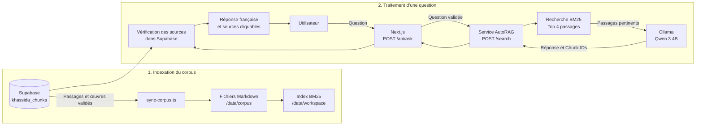

# Schéma du RAG de Xassida Search

## Architecture générale



## Contenu d’un passage indexé

Chaque ligne validée de `khassida_chunks` devient un fichier Markdown :

```md
# Titre du khassida

Chunk-ID: uuid-du-passage
Slug: nom-du-khassida
Chapitre: 1
Vers: 12-14
Page: 32

## Arabe

النص العربي

## Transcription

Transcription latine

## Traduction française

Traduction du passage

## Commentaire éditorial

Commentaire éventuel
```

## Parcours d’une question

1. L’interface envoie la question à `POST /api/ask`.
2. L’API contrôle la taille de la requête, le quota, la concurrence et la configuration.
3. Le service AutoRAG effectue une recherche lexicale BM25.
4. Les quatre passages les mieux classés sont envoyés à Ollama.
5. `qwen3:4b` produit une réponse française de trois phrases maximum.
6. AutoRAG renvoie la réponse et les identifiants des passages.
7. `/api/ask` recharge ces passages depuis Supabase.
8. Seuls les passages `verified` appartenant à une œuvre publiée sont conservés.
9. L’interface reçoit la réponse et les sources autorisées.

## Contrat de réponse

```ts
type AskResponse = {
  answer: string;
  sources: Array<{
    id: string;
    title: string;
    slug: string;
    arabic_text: string | null;
    transcription: string | null;
    french_translation: string | null;
    reference: string;
  }>;
};
```

## Situation actuelle des textes arabes

Le problème d’affichage de l’arabe se situe en amont du RAG. Au moment de la vérification :

- 129 passages Supabase étaient validés ;
- 129 passages possédaient une traduction française ;
- aucun passage ne possédait de valeur dans `arabic_text`.

L’API et l’interface savent déjà transmettre et afficher `arabic_text`. Les vers arabes doivent d’abord être importés dans `khassida_chunks`, puis le corpus AutoRAG doit être resynchronisé.

## Composants principaux

| Composant                        | Responsabilité                                                 |
| -------------------------------- | -------------------------------------------------------------- |
| `xassida-rag/sync-corpus.ts`     | Exporte les passages Supabase validés vers le corpus Markdown. |
| `xassida-rag/server.ts`          | Expose le service RAG privé et orchestre BM25 et Ollama.       |
| `xassida-rag/rag-response.ts`    | Construit le prompt et normalise la réponse générée.           |
| `lib/autorag.ts`                 | Appelle le service AutoRAG depuis l’application Next.js.       |
| `app/api/ask/route.ts`           | Protège l’API et vérifie les sources dans Supabase.            |
| `components/ai/AskInterface.tsx` | Affiche la conversation et les passages sources.               |
