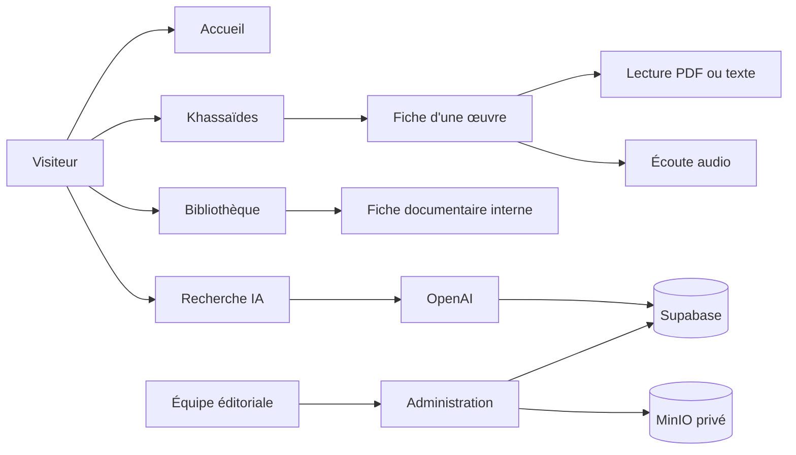

# Documentation de Xassida Search

Ce dossier est la documentation de référence du projet. Il sépare volontairement la présentation technique des procédures éditoriales.

## Parcours de lecture

1. [Architecture du projet](./ARCHITECTURE.md) — composants, routes, données et services.
2. [Workflows](./WORKFLOWS.md) — publication, médias, bibliothèque, recherche et IA.
3. [Exploitation et développement](./EXPLOITATION.md) — installation, variables, commandes, sécurité et déploiement.
4. [Stockage MinIO](./MINIO.md) — fichiers privés, imports, routes signées, diagnostic et sauvegarde.
5. [Ajouter un nouveau khassida](./AJOUTER-UN-KHASSIDA.md) — procédure éditoriale détaillée.
6. [Audit du code mort](./AUDIT-CODE-MORT.md) — éléments inutilisés, obsolètes ou à confirmer.

## Périmètre fonctionnel

La distinction métier est la suivante :

- **Khassaïdes** contient uniquement les œuvres poétiques de Cheikh Ahmadou Bamba.
- **Bibliothèque** contient un ensemble documentaire plus large autour du mouridisme : livres, articles, biographies, conférences, audios, vidéos, manuscrits et archives.
