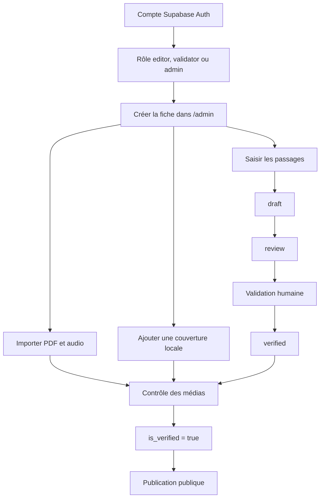
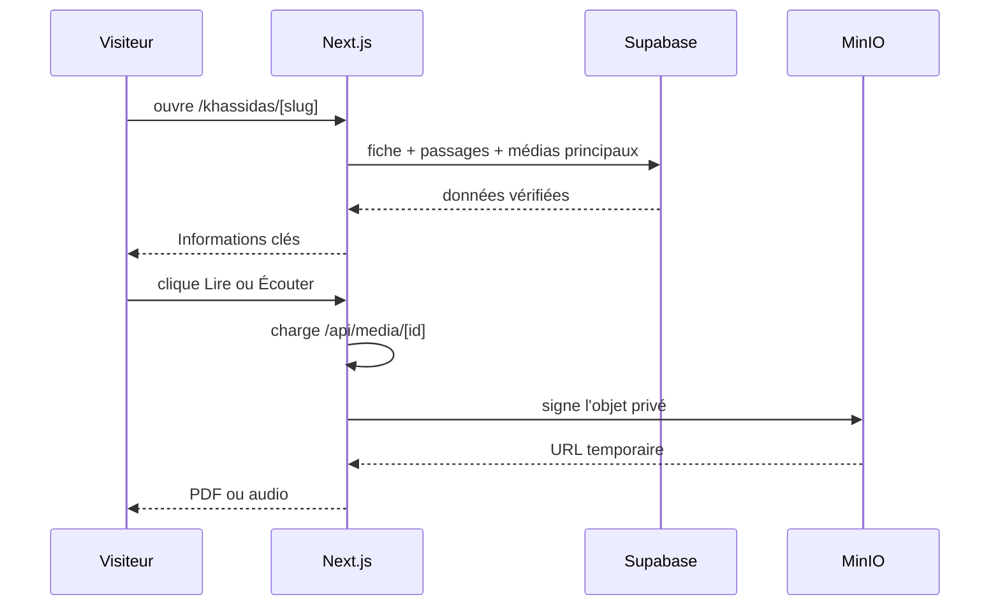
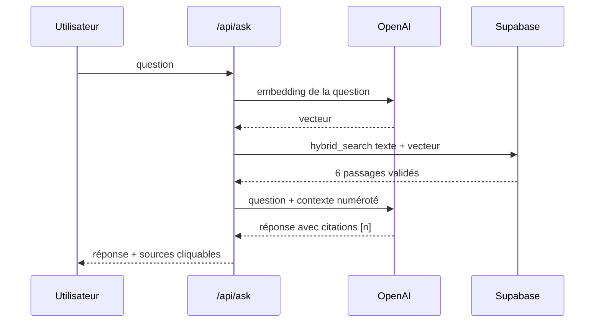
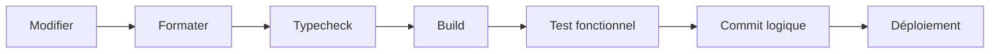

# Workflows du projet

## 1. Publier un khassida

Le guide complet est dans [AJOUTER-UN-KHASSIDA.md](./AJOUTER-UN-KHASSIDA.md).



Une fiche et ses passages ont des statuts distincts. Publier la fiche ne rend pas les brouillons visibles; seuls les passages `verified` sont lus par le public et par l’IA.

## 2. Lire ou écouter un khassida



Le lecteur audio global ne doit apparaître qu’après un clic sur **Écouter**. L’audio n’implique pas l’affichage de paroles synchronisées.

## 3. Ajouter une ressource à la bibliothèque

Les ressources sont préparées dans `scripts/seed-library.ts`, puis insérées de façon idempotente avec :

```bash
bun run seed:library
```

Workflow éditorial recommandé :

```mermaid
flowchart LR
    A[Identifier une source] --> B[Vérifier auteur, langue et provenance]
    B --> C[Valider les droits et la stabilité]
    C --> D[Créer une fiche library_items]
    D --> E[is_verified = true]
    E --> F[/bibliotheque]
    F --> G[/bibliotheque/slug]
```

La navigation principale reste interne : une carte ouvre toujours `/bibliotheque/[slug]`. Une vidéo YouTube peut être intégrée dans la fiche via le domaine sans cookies. Pour un article, un livre ou un audio non hébergé, la fiche conserve actuellement un lien secondaire vers l’original. Pour garantir un fonctionnement entièrement local, il faudra obtenir le droit d’héberger le document, importer le fichier dans le stockage privé et relier la fiche à ce média.

## 4. Recherche classique

1. `/api/search` charge le catalogue validé et les statistiques de médias/pages.
2. Il normalise la requête avec `normalizeSearch`.
3. Il cherche d’abord dans titres, titres arabes, variantes et thèmes.
4. Il appelle la fonction PostgreSQL `hybrid_search` pour les passages.
5. Il fusionne les résultats sans dupliquer une œuvre déjà trouvée par un passage.

Sans requête, l’API renvoie le catalogue public utilisé par l’accueil.

## 5. Recherche IA sourcée



Si aucune source validée ne suffit, l’API renvoie une réponse de repli explicite. Toute correction de texte devrait entraîner un recalcul de l’embedding correspondant.

## 6. Migrer ou importer les médias

| Commande | Usage |
| --- | --- |
| `bun run import:xassaid` | Associer/importer le catalogue PDF Xassaid et extraire le texte disponible |
| `bun run migrate:minio` | Copier dans MinIO les médias déjà référencés |
| `bun run import:astahfir` | Import spécialisé du PDF/audio d’Astahfirul Laha Bihi |
| `bun run import:jazbul-audio` | Extraire/importer l’audio de Jazbul Qulub |

Ces scripts modifient les données et/ou le stockage distant. Ils doivent être lancés avec `.env.local` correctement configuré et après sauvegarde adaptée.

## 7. Livraison



Chaque commit doit représenter une intention unique : schéma, import de données, interface, correctif média ou documentation.

